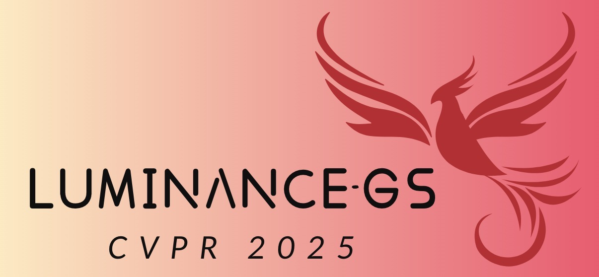

# [CVPR 2025] Luminance-GS: Adapting 3D Gaussian Splatting to Challenging Lighting Conditions with View-Adaptive Curve Adjustment

**2025.2.27 :** Paper accepted by **CVPR 2025** !

  

[Ziteng Cui1](https://cuiziteng.github.io/), 
[Xuangeng Chu1](https://xg-chu.site/), 
[Tatsuya Harada1,2](https://www.mi.t.u-tokyo.ac.jp/harada/). 

1.The University of Tokyo, 2.RIKEN AIP.

 

***" The light was brighter.
The taste was sweeter.
\
The nights of wonder.
With friends surrounded."
\
&ensp; &ensp; &ensp; &ensp; &ensp; &ensp; &ensp; &ensp; &ensp; &ensp; &ensp; &ensp; -- Pink Floyd (High Hopes)***

 

